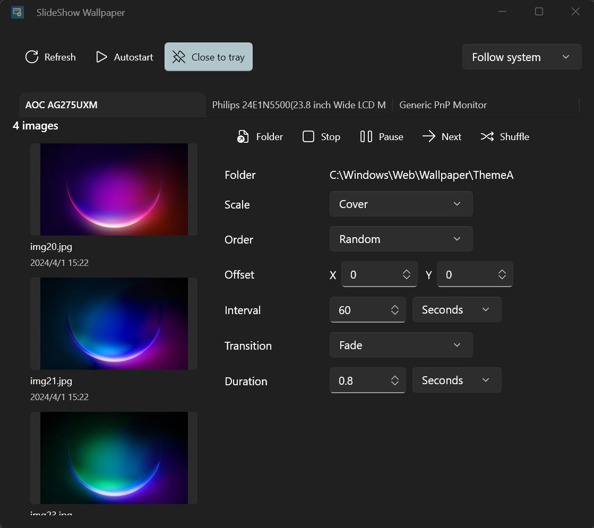

# SlideShow Wallpaper

WinUI 3 desktop app for running per-monitor wallpaper slideshows on Windows.



The screenshot above uses images from `C:\Windows\Web\Wallpaper\ThemeA`.

## Features

- Per-monitor wallpaper folders and playback controls.
- Independent stop, pause, next, and shuffle actions for each display.
- Image previews with lazy thumbnail loading and thumbnail cache under `%TEMP%`.
- Playback order options: Random, Name Asc, Name Desc, Modified Date Asc, Modified Date Desc.
- Scale modes including Cover, Fit, Stretch, and Original.
- Offset, interval, transition, and duration controls.
- Tray menu with monitor-specific actions.
- Close-to-tray option and quiet startup via `/q`.
- App settings saved to `SlideShowWallpaper.ini` next to the executable.
- Light, dark, and system theme modes.

## Build

```powershell
$Platform = if ($env:PROCESSOR_ARCHITECTURE -eq 'AMD64') { 'x64' } else { $env:PROCESSOR_ARCHITECTURE }
dotnet build .\SlideShowWallpaper.csproj -c Debug -p:Platform=$Platform
```

## Test

```powershell
$Platform = if ($env:PROCESSOR_ARCHITECTURE -eq 'AMD64') { 'x64' } else { $env:PROCESSOR_ARCHITECTURE }
dotnet test .\SlideShowWallpaper.Tests\SlideShowWallpaper.Tests.csproj -c Debug -p:Platform=$Platform
```

## Single-File Release

```powershell
$Platform = if ($env:PROCESSOR_ARCHITECTURE -eq 'AMD64') { 'x64' } else { $env:PROCESSOR_ARCHITECTURE }
dotnet build .\SlideShowWallpaper.csproj -c Release -p:Platform=$Platform -t:BuildSingleFile
```

The executable is published to:

```text
artifacts\release\win-x64\SlideShowWallpaper.exe
```

## Quiet Startup

Use `/q` to start directly in the tray:

```powershell
.\artifacts\release\win-x64\SlideShowWallpaper.exe /q
```
