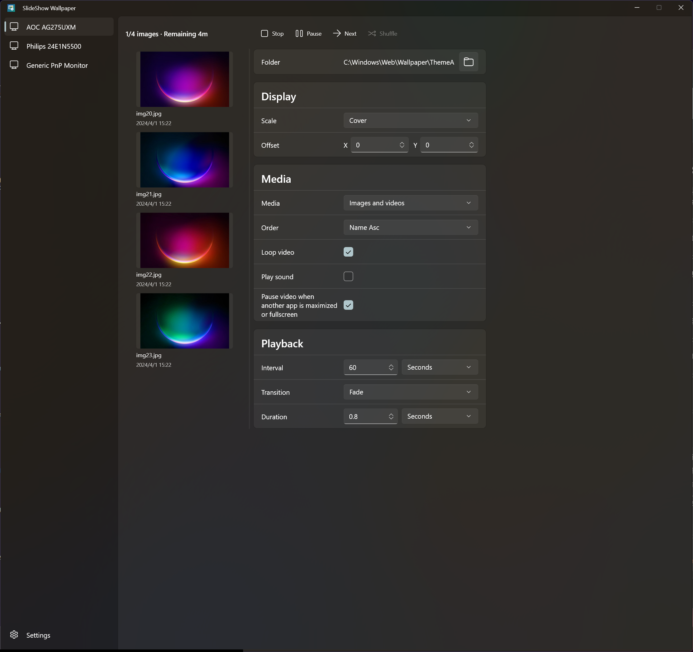

# SlideShow Wallpaper

WinUI 3 desktop app for running per-monitor wallpaper slideshows on Windows.



## Features

- Per-monitor folders, playback controls, status, and preview lists.
- Lazy thumbnail loading with JPEG thumbnail cache under `%TEMP%`.
- Thumbnail and folder-order caches are retained across tray reopen so the UI can come back quickly without rescanning folders.
- Image and video playback in the same folder, with media filter options for images, videos, or both.
- NDF playback with on-demand materialization for full media and in-memory thumbnail extraction.
- Random, single-loop, name, and modified-date playback order options, plus shuffle for random order.
- Cover, fit, stretch, and original scale modes with per-monitor offsets and transitions.
- Cover offset layout is applied to both images and videos without exposing black borders.
- Folder watching with collapsed rescans, so playlist updates are picked up after changes.
- Video options for looping, sound, and pausing video while another app is maximized or fullscreen.
- Global settings for language, automatic file tracking, mute-all-video, and thumbnail cache.
- Per-display tray actions, close-to-tray, quiet startup via `/q`, and single-instance activation.
- Quiet startup and minimized windows avoid building the settings/preview UI until the main window is opened.
- App settings saved to `SlideShowWallpaper.ini` next to the executable.
- Light, dark, and system theme modes with localized UI resources.

## Build

```powershell
$Platform = if ($env:PROCESSOR_ARCHITECTURE -eq 'AMD64') { 'x64' } else { $env:PROCESSOR_ARCHITECTURE }
dotnet build .\SlideShowWallpaper.csproj -c Debug -p:Platform=$Platform
```

## Test

```powershell
$Platform = if ($env:PROCESSOR_ARCHITECTURE -eq 'AMD64') { 'x64' } else { $env:PROCESSOR_ARCHITECTURE }
dotnet test .\SlideShowWallpaper.Tests\SlideShowWallpaper.Tests.csproj -c Debug -p:Platform=$Platform
```

## Single-File Release

```powershell
$Platform = if ($env:PROCESSOR_ARCHITECTURE -eq 'AMD64') { 'x64' } else { $env:PROCESSOR_ARCHITECTURE }
dotnet build .\SlideShowWallpaper.csproj -c Release -p:Platform=$Platform -t:BuildSingleFile
```

The executable is published to:

```text
artifacts\release\win-x64\SlideShowWallpaper.exe
```

The default single-file target is framework-dependent to keep the executable smaller. It expects the .NET Desktop Runtime and Windows App Runtime to be available on the machine.

For a larger self-contained build:

```powershell
$Platform = if ($env:PROCESSOR_ARCHITECTURE -eq 'AMD64') { 'x64' } else { $env:PROCESSOR_ARCHITECTURE }
dotnet build .\SlideShowWallpaper.csproj -c Release -p:Platform=$Platform -t:BuildSingleFileSelfContained
```

## Quiet Startup

Use `/q` to start directly in the tray:

```powershell
.\artifacts\release\win-x64\SlideShowWallpaper.exe /q
```
