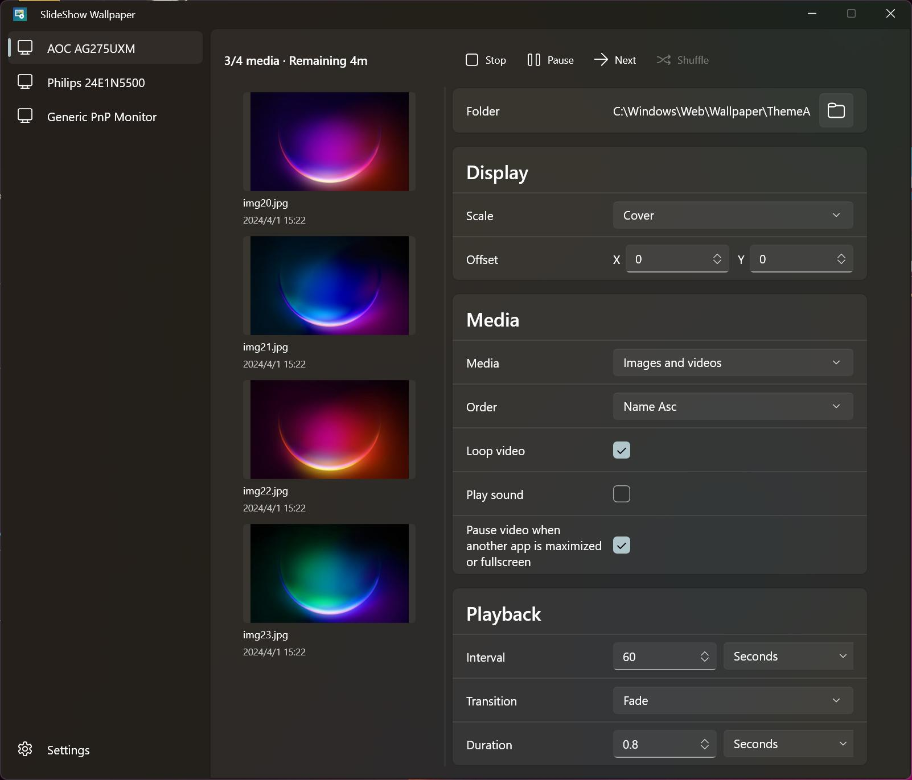

# SlideShow Wallpaper

WinUI 3 desktop app for running per-monitor wallpaper slideshows on Windows.



## Features

- Independent folders, playback controls, status, preview lists, and tray actions for each monitor.
- Image, video, and N0va Desktop `.ndf` wallpaper playback in the same folder.
- Media filters for images only, videos only, or images and videos together. GIF files are not included.
- Random, single-loop, name, and modified-date playback order options, plus shuffle for random order.
- Cover, fit, stretch, and original scale modes with per-monitor offsets and transitions.
- Wallpapers stay behind desktop icons while filling each monitor without black borders in cover mode.
- Automatic folder watching so playlist changes are picked up after files are added or removed.
- Video controls for looping, sound, preview-on-hover, and pausing video while another app is maximized or fullscreen.
- Fast reopen from the tray with thumbnail and folder-order caching, plus lower background memory use when the settings window is hidden.
- Global settings for language, theme, automatic file tracking, mute-all-video, thumbnail cache, close-to-tray, and Start with Windows.
- Light, dark, and system theme modes with English, Simplified Chinese, Traditional Chinese, and Japanese UI.
- Quiet startup via `/q`, and launching the app again brings forward the existing window.
- App settings are saved to `SlideShowWallpaper.ini` next to the executable.

## Build

The project currently targets x64.

```powershell
dotnet build .\SlideShowWallpaper.csproj -c Debug -p:Platform=x64
```

## Test

```powershell
dotnet test .\SlideShowWallpaper.Tests\SlideShowWallpaper.Tests.csproj -c Debug -p:Platform=x64
```

## Single-File Release

```powershell
dotnet build .\SlideShowWallpaper.csproj -c Release -p:Platform=x64 -t:BuildSingleFile
```

The executable is published to:

```text
artifacts\release\win-x64\SlideShowWallpaper.exe
```

The default single-file target is framework-dependent to keep the executable smaller. It expects the .NET Desktop Runtime and Windows App SDK runtime to be available on the machine.

For a larger self-contained build:

```powershell
dotnet build .\SlideShowWallpaper.csproj -c Release -p:Platform=x64 -t:BuildSingleFileSelfContained
```

## Quiet Startup

Use `/q` to start directly in the tray:

```powershell
.\artifacts\release\win-x64\SlideShowWallpaper.exe /q
```
